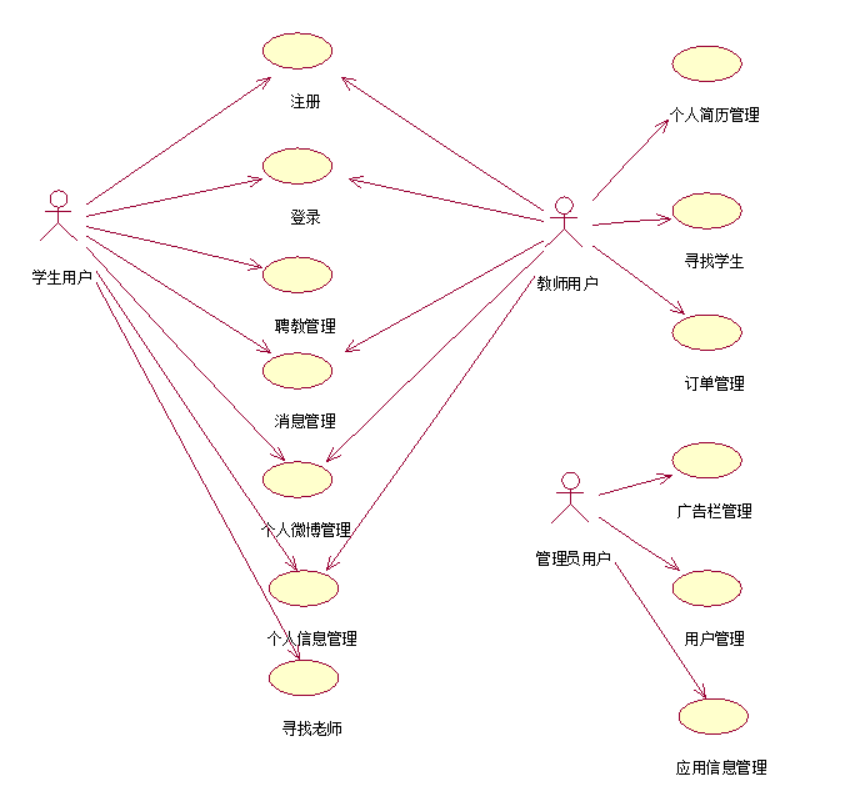

# 软件需求规格说明书

## 1.引言

### 1.1编写目的

 该文档首先给出项目的整体结构和功能结构概貌，试图从总体架构上给出整个系统的轮廓。同时对功能需求、性能需求进行了详细的描述。便于用户、开发人员进行理解和交流，反映出用户问题的结构，可以作为软件开发工作的基础和依据以及确认测试和验收的依据。
    本文档面向多种读者对象：
（1）项目经理：项目经理可以根据该文档了解预期产品的功能，并据此进行系统设计、项目管理。
（2）设计员：对需求进行分析，并设计出系统，包括数据库的设计。
（3）程序员：了解系统功能，编写《用户手册》。
（4）测试员：根据本文档编写测试用例，并对软件产品进行功能性测试和非功能性测试。
（5）用户：了解预期产品的功能和性能，并与分析人员一起对整个需求进行讨论和协商。
在阅读本文档时，首先要了解产品的功能概貌，然后可以根据自身的需要对每一功能进行适当的了解。

### 1.2背景

说明：

- 大学生家教app

- 本项目为小组组长提出

- 该软件系统为一个c2c的平台，让用户直接商谈协商

### 1.3定义
1.	app	应用程序，Application的缩写，一般指手机软件。
2.	Android	Android是一种基于Linux的自由及开放源代码的操作系统，主要使用于移动设备，如智能手机和平板电脑，由Google公司和开放手机联盟领导及开发。

### 1.4参考资料

[1] GB-T8567-2006，《计算机软件文档编制规范》[S]
[2].（美）Roger S.Pressman著，郑人杰等译.软件工程[M].第七版.北京：机械工业出版社,2011.

## 2任务概述

### 2.1目标

大学生家教已经是大学生群体中普遍的一种兼职方式，当下家教行业中一般是以家教机构为中介，这种商业模式依靠从双方客户抽水得到盈利。显然，如果去掉家教机构中介，让需要聘请家教的客户与申请家教兼职的大学生直接对接，可以降低前者的聘教支出和后者的工作收入，为此，需要建立这样一个C2C的平台，让用户直接面谈协商。按照现实模式的需求，请求家教老师的一方只需要表明自己的需要，说清楚自己的学习状况，和期望的家教老师类型，留下联系电话即可，剩余的事务交由家教中介处理；而家教老师需要向机构注册身份，晒出自己的简历，同样留下联系方式，待中介机构分配请求。因此，为了开发一个可以代替机构中介的平台，我们需要将现实中的需求转化成平台的功能。

### 2.2用户的特点
本软件的最终用户为有意申请家教的大学生与需要聘请家教的客户
本系统在每周7天，每天24小时都可以使用。宕机的时间应少于1%。

### 2.3假定和约束

进行本软件开发工作的约束条件如下：
1.开发周期短：两个月的开发时间需要开发者合理规划时间，做到多项任务并发。
2.所采用的方法与技术有限：项目团队成员的技术水平不够成熟，需要在开发中并发学习多种技术和能力。 

## 3需求规定

### 3.1对功能的规定

客户端应用基于MVP架构、模块化进行搭建和开发。项目分为三层，分别是View层、Presenter层和Model层。该三层具有明显的依赖关系，Presenter层依赖于View层和Model层。

View层。View层是用户与应用交互的界面，负责获取用户的请求和信息，向用户展示系统操作的结果。

Presenter层。Presenter层是应用业务的核心，控制管理应用的运行。它负责接收用户的请求和信息，调用Model层的数据操作API，执行系统的业务逻辑操作，并把操作的结果返回给用户。

Model层。Model层是根据客户端与服务端进行数据交互的需要而封装的操作接口。

### 3.2对性能的规定

#### 3.2.1精度

在既定的任意时刻，系统最多可支持2000名用户同时使用中央数据库，并在任意时刻最多可支持500名用户同时使用本地服务器。

#### 3.2.2时间特性要求

  响应时间：系统必须能够在5秒钟内对用户的请求做出反应。

### 3.3输人输出要求

第一次安装成功后，启动APP进入登录界面——注册界面
登录成功后可以选择身份与填写个人信息，与陌生人进行聊天，发布家教需求，查找老师或者朋友圈互动等

### 3.4数据管理能力要求

用户人数能够支持2000人

### 3.5其他专门要求

系统必须能防止用户查看或修改其他用户的个人信息 系统只允许管理员处理用户信息

## 4运行环境规定

### 4.1设备

本APP应与Android5.0以上的手机安卓系统兼容。

### 4.2支持软件

无特殊要求

### 4.3接口

无特殊要求

### 4.4控制

无特殊要求
